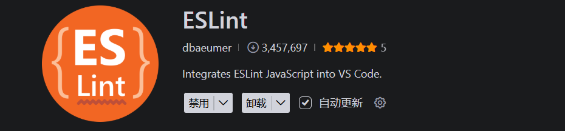

# VS Code 常用插件推荐

> 记录日常使用中觉得好用的VS Code插件，持续更新中。

---

## 1. 代码质量与格式化

### ESLint

**功能**：代码规范检查，识别潜在问题

**插件ID**：`dbaeumer.vscode-eslint`

**作者**：Dirk Baeumer

**安装命令**：`ext install dbaeumer.vscode-eslint`

**截图**：

<!-- 在此处插入 ESLint 截图 -->


---

### Prettier

**功能**：代码格式化，统一代码风格

**插件ID**：`esbenp.prettier-vscode`

**作者**：Esben Petersen

**安装命令**：`ext install esbenp.prettier-vscode`

**截图**：

<!-- 在此处插入 Prettier 截图 -->


---

### Stylelint

**功能**：CSS/SCSS/Less 代码检查

**插件ID**：`stylelint.vscode-stylelint`

**作者**：Stylelint

**安装命令**：`ext install stylelint.vscode-stylelint`

**截图**：

<!-- 在此处插入 Stylelint 截图 -->


---

### EditorConfig

**功能**：统一不同编辑器的配置

**插件ID**：`editorconfig.editorconfig`

**作者**：EditorConfig

**安装命令**：`ext install editorconfig.editorconfig`

**截图**：

<!-- 在此处插入 EditorConfig 截图 -->


---

## 2. 语言支持

### Vetur

**功能**：Vue.js 完整支持

**插件ID**：`octref.vetur`

**作者**：Pine Wu

**安装命令**：`ext install octref.vetur`

**截图**：

<!-- 在此处插入 Vetur 截图 -->


---

### React Developer Tools

**功能**：React 开发工具

**插件ID**：`msjsdiag.vscode-react-debugger`

**作者**：Facebook

**安装命令**：`ext install msjsdiag.vscode-react-debugger`

**截图**：

<!-- 在此处插入 React Developer Tools 截图 -->


---

### TypeScript Extension Pack

**功能**：TypeScript 工具集

**插件ID**：`ms-vscode.vscode-typescript-next`

**作者**：Microsoft

**安装命令**：`ext install ms-vscode.vscode-typescript-next`

**截图**：

<!-- 在此处插入 TypeScript Extension Pack 截图 -->


---

## 3. 开发效率

### Live Server

**功能**：本地开发服务器，实时预览

**插件ID**：`ritwickdey.liveserver`

**作者**：Ritwick Dey

**安装命令**：`ext install ritwickdey.liveserver`

**截图**：

<!-- 在此处插入 Live Server 截图 -->


---

### Auto Rename Tag

**功能**：自动重命名配对标签

**插件ID**：`formulahendry.auto-rename-tag`

**作者**：Jun Han

**安装命令**：`ext install formulahendry.auto-rename-tag`

**截图**：

<!-- 在此处插入 Auto Rename Tag 截图 -->


---

### Path Intellisense

**功能**：路径自动补全

**插件ID**：`christian-kohler.path-intellisense`

**作者**：Christian Kohler

**安装命令**：`ext install christian-kohler.path-intellisense`

**截图**：

<!-- 在此处插入 Path Intellisense 截图 -->


---

### Bracket Pair Colorizer

**功能**：括号颜色区分配对

**插件ID**：`coenraads.bracket-pair-colorizer`

**作者**：CoenraadS

**安装命令**：`ext install coenraads.bracket-pair-colorizer`

**截图**：

<!-- 在此处插入 Bracket Pair Colorizer 截图 -->


---

### Code Spell Checker

**功能**：拼写检查

**插件ID**：`streetsidesoftware.code-spell-checker`

**作者**：Street Side Software

**安装命令**：`ext install streetsidesoftware.code-spell-checker`

**截图**：

<!-- 在此处插入 Code Spell Checker 截图 -->


---

## 4. 版本控制

### GitLens

**功能**：Git 增强，显示代码作者和修改历史

**插件ID**：`eamodio.gitlens`

**作者**：Eric Amodio

**安装命令**：`ext install eamodio.gitlens`

**截图**：

<!-- 在此处插入 GitLens 截图 -->


---

### Git History

**功能**：查看 Git 历史和比较

**插件ID**：`donjayamanne.githistory`

**作者**：Don Jayamanne

**安装命令**：`ext install donjayamanne.githistory`

**截图**：

<!-- 在此处插入 Git History 截图 -->


---

### GitHub Pull Requests

**功能**：GitHub PR 管理

**插件ID**：`github.vscode-pull-request-github`

**作者**：GitHub

**安装命令**：`ext install github.vscode-pull-request-github`

**截图**：

<!-- 在此处插入 GitHub Pull Requests 截图 -->


---

## 5. 视觉美化

### One Dark Pro

**功能**：流行的深色主题

**插件ID**：`zhuangtongfa.material-theme`

**作者**：Binaryify

**安装命令**：`ext install zhuangtongfa.material-theme`

**截图**：

<!-- 在此处插入 One Dark Pro 截图 -->


---

### Material Icon Theme

**功能**：图标主题

**插件ID**：`pkief.material-icon-theme`

**作者**：Philipp Kief

**安装命令**：`ext install pkief.material-icon-theme`

**截图**：

<!-- 在此处插入 Material Icon Theme 截图 -->


---

### Indent Rainbow

**功能**：缩进颜色区分

**插件ID**：`oderwat.indent-rainbow`

**作者**：oderwat

**安装命令**：`ext install oderwat.indent-rainbow`

**截图**：

<!-- 在此处插入 Indent Rainbow 截图 -->


---

### TODO Highlight

**功能**：高亮 TODO 注释

**插件ID**：`wayou.vscode-todo-highlight`

**作者**：Wayou Liu

**安装命令**：`ext install wayou.vscode-todo-highlight`

**截图**：

<!-- 在此处插入 TODO Highlight 截图 -->


---

## 6. 其他实用工具

### REST Client

**功能**：在编辑器中发送 HTTP 请求

**插件ID**：`humao.rest-client`

**作者**：Huachao Mao

**安装命令**：`ext install humao.rest-client`

**截图**：

<!-- 在此处插入 REST Client 截图 -->


---

### Markdown Preview Enhanced

**功能**：增强的 Markdown 预览

**插件ID**：`shd101wyy.markdown-preview-enhanced`

**作者**：Yiyi Wang

**安装命令**：`ext install shd101wyy.markdown-preview-enhanced`

**截图**：

<!-- 在此处插入 Markdown Preview Enhanced 截图 -->


---

### SVG Viewer

**功能**：SVG 预览

**插件ID**：`cssho.vscode-svgviewer`

**作者**：CSS Tricks

**安装命令**：`ext install cssho.vscode-svgviewer`

**截图**：

<!-- 在此处插入 SVG Viewer 截图 -->


---

### Polacode

**功能**：代码截图美化

**插件ID**：`pnp.polacode`

**作者**：Prakhar Srivastav

**安装命令**：`ext install pnp.polacode`

**截图**：

<!-- 在此处插入 Polacode 截图 -->


---

## 截图存放位置

建议将插件截图统一存放在以下目录：

```
01-VS Code/
├── 01-VSCode安装配置.md
├── 02-常用插件推荐.md
└── screenshots/              # 截图存放目录
    ├── eslint.png
    ├── prettier.png
    ├── vetur.png
    ├── live-server.png
    ├── gitlens.png
    └── ...
```

## 相关资源

- [VS Code 官方插件市场](https://marketplace.visualstudio.com/)
- [VS Code 插件搜索](https://marketplace.visualstudio.com/search?target=VSCode)

---

*Last updated: 2026-05-22*
